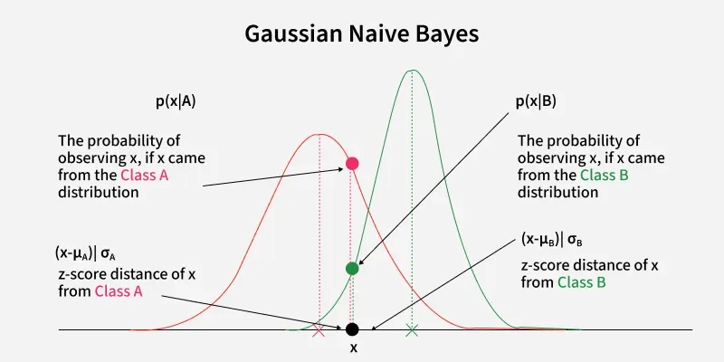
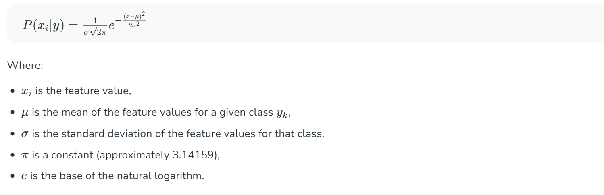

# Gausian Naive Bayes

- Gaussian Naive Bayes is a type of Naive Bayes method working on continuous attributes and the data features that follows Gaussian distribution throughout the dataset.
- It is based on the Bayes' theorem and the assumption of feature independence.
- We use Gaussian Naive Bayes when features are continuous and best modeled by normal distributions instead of discrete counts or binary values.

## Why Gaussian Naive Bayes Works Well for Continuous Data?

- Gaussian Naive Bayes is effective for continuous data because it assumes each feature follows a Gaussian (normal) distribution.
- When this assumption holds true the algorithm performs well. For example in tasks like spam detection, medical diagnosis or predicting house prices where features such as age, income or height fit a normal distribution there Gaussian Naive Bayes can make accurate predictions.

## How it Works?

- Gaussian Naive Bayes works by first estimating the mean and standard deviation of each feature for each class.
- Then for a new data point it calculates the probability of each class given the feature values using the Gaussian distribution.

## Formula

The Gaussian formula is used to convert a raw number (like 70 marks) into a probability so that Naive Bayes can compare classes.

## Example

## Step-by-Step Gaussian Naive Bayes Example

## Problem: Predict **Pass / Fail** using marks

---

## 1️⃣ Training Dataset

| Student | Math | Physics | Result |
| ------- | ---- | ------- | ------ |
| A       | 78   | 72      | Pass   |
| B       | 82   | 80      | Pass   |
| C       | 75   | 70      | Pass   |
| D       | 35   | 40      | Fail   |
| E       | 42   | 38      | Fail   |
| F       | 30   | 45      | Fail   |

---

## 2️⃣ Step 1: Compute Class Priors

Total students = 6

- Pass = 3
- Fail = 3

$$
P(Pass) = \frac{3}{6} = 0.5
$$

$$
P(Fail) = \frac{3}{6} = 0.5
$$

---

## 3️⃣ Step 2: Compute Mean & Variance (Per Class, Per Feature)

### 🔹 PASS class

#### Math scores: [78, 82, 75]

$$
\mu_{Pass,Math} = \frac{78 + 82 + 75}{3} = 78.33
$$

$$
\sigma^2_{Pass,Math} =
\frac{(78-78.33)^2 + (82-78.33)^2 + (75-78.33)^2}{3}
= 8.22
$$

---

#### Physics scores: [72, 80, 70]

$$
\mu_{Pass,Physics} = 74
$$

$$
\sigma^2_{Pass,Physics} = 18.67
$$

---

### 🔹 FAIL class

#### Math scores: [35, 42, 30]

$$
\mu_{Fail,Math} = 35.67
$$

$$
\sigma^2_{Fail,Math} = 24.22
$$

---

#### Physics scores: [40, 38, 45]

$$
\mu_{Fail,Physics} = 41
$$

$$
\sigma^2_{Fail,Physics} = 8.67
$$

---

## 4️⃣ Step 3: New Student to Predict

Math = 70  
Physics = 68

---

## 5️⃣ Step 4: Apply Gaussian Formula

$$
P(x|y) = \frac{1}{\sqrt{2\pi\sigma^2}}
\exp\left(-\frac{(x-\mu)^2}{2\sigma^2}\right)
$$

---

## 6️⃣ Step 5: Combine with Priors

### PASS score

$$
0.5 \times 0.018 \times 0.021 = 0.000189
$$

### FAIL score

$$
0.5 \times 0.0002 \times 0.00003 = 0.000000003
$$

---

## 7️⃣ Final Prediction

$$
0.000189 \gg 0.000000003
$$

**Prediction = PASS**
