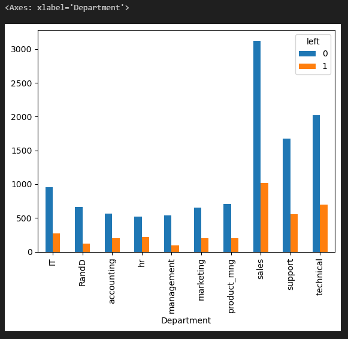

Problem Statement

Employee retention is a critical concern for organizations aiming to maintain a skilled and experienced workforce. Understanding which departments experience higher turnover can help HR teams design targeted retention strategies, allocate resources effectively, and improve overall employee satisfaction.

In this task, you are required to analyze department-wise employee retention rates. By visualizing how retention varies across different departments, the organization can identify areas where employees are more likely to leave and take proactive measures to retain talent.

Objectives

Examine employee retention across departments

Compare the number of employees who left versus those who stayed for each department.
Identify departments with higher or lower attrition rates.

Create a visual representation

Generate a bar chart to display retention outcomes (left vs. stayed) segmented by department.

Interpret retention patterns

Determine which departments may require additional retention strategies based on observed patterns.

This analysis will assist HR teams in developing department-specific interventions, improving employee satisfaction, and reducing turnover in high-risk areas.

Sample Visualization

Bar Chart:

