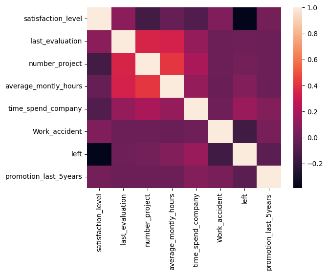

**Problem Statement**

Before performing any predictive modeling or advanced analytics, it is essential to understand the relationships between variables in the dataset. Correlation analysis helps identify how strongly different numerical features are related, enabling data scientists to detect redundant variables, uncover meaningful patterns, and make informed decisions during feature selection.

In this task, you are required to analyze correlations among all numerical attributes in the dataset. By computing and visualizing the correlation matrix, the organization can better understand how different factors interact, which features may influence employee retention, and which variables may require additional attention during preprocessing.

**Objectives**

**Detect correlations within numerical features**

- Compute the correlation matrix for all numeric columns in the dataset.
- Identify strong positive or negative correlations that may influence further analysis.

**Visualize the correlation Problem Statement**

**Before performing any predictive modeling or advanced analytics, it is essential to understand the relationships between variables in the dataset. Correlation analysis helps identify how strongly different numerical features are related, enabling data scientists to detect redundant variables, uncover meaningful patterns, and make informed decisions during feature selection.**

**In this task, you are required to analyze correlations among all numerical attributes in the dataset. By computing and visualizing the correlation matrix, the organization can better understand how different factors interact, which features may influence employee retention, and which variables may require additional attention during preprocessing.**

**Objectives**

**Detect correlations within numerical features**

**Compute the correlation matrix for all numeric columns in the dataset.**

**Identify strong positive or negative correlations that may influence further analysis.**

**Visualize the correlation structure**

**Generate a heatmap to display correlation strengths in an intuitive and interpretable format.**

**Highlight areas where features are highly correlated or show minimal association.**

**Support data preparation and feature engineering**

**Use insights from the correlation analysis to guide decisions such as removing redundant variables, selecting key features, or understanding underlying patterns in the dataset.**

**This analysis will help the organization build a cleaner, more informative dataset, ensuring higher-quality insights and improved performance in subsequent machine learning tasks.**

**Sample Visualization**

**Heat Map:Problem Statement**

**Before performing any predictive modeling or advanced analytics, it is essential to understand the relationships between variables in the dataset. Correlation analysis helps identify how strongly different numerical features are related, enabling data scientists to detect redundant variables, uncover meaningful patterns, and make informed decisions during feature selection.**

**In this task, you are required to analyze correlations among all numerical attributes in the dataset. By computing and visualizing the correlation matrix, the organization can better understand how different factors interact, which features may influence employee retention, and which variables may require additional attention during preprocessing.**

**Objectives**

**Detect correlations within numerical features**

**Compute the correlation matrix for all numeric columns in the dataset.**

**Identify strong positive or negative correlations that may influence further analysis.**

**Visualize the correlation structure**

**Generate a heatmap to display correlation strengths in an intuitive and interpretable format.**

**Highlight areas where features are highly correlated or show minimal association.**

**Support data preparation and feature engineering**

**Use insights from the correlation analysis to guide decisions such as removing redundant variables, selecting key features, or understanding underlying patterns in the dataset.**

**This analysis will help the organization build a cleaner, more informative dataset, ensuring higher-quality insights and improved performance in subsequent machine learning tasks.**

**Sample Visualization**

**Heat Map:Problem Statement**

**Before performing any predictive modeling or advanced analytics, it is essential to understand the relationships between variables in the dataset. Correlation analysis helps identify how strongly different numerical features are related, enabling data scientists to detect redundant variables, uncover meaningful patterns, and make informed decisions during feature selection.**

**In this task, you are required to analyze correlations among all numerical attributes in the dataset. By computing and visualizing the correlation matrix, the organization can better understand how different factors interact, which features may influence employee retention, and which variables may require additional attention during preprocessing.**

**Objectives**

**Detect correlations within numerical features**

**Compute the correlation matrix for all numeric columns in the dataset.**

**Identify strong positive or negative correlations that may influence further analysis.**

**Visualize the correlation structure**

**Generate a heatmap to display correlation strengths in an intuitive and interpretable format.**

**Highlight areas where features are highly correlated or show minimal association.**

**Support data preparation and feature engineering**

**Use insights from the correlation analysis to guide decisions such as removing redundant variables, selecting key features, or understanding underlying patterns in the dataset.**

**This analysis will help the organization build a cleaner, more informative dataset, ensuring higher-quality insights and improved performance in subsequent machine learning tasks.**

**Sample Visualization**

**Heat Map:Problem Statement**

**Before performing any predictive modeling or advanced analytics, it is essential to understand the relationships between variables in the dataset. Correlation analysis helps identify how strongly different numerical features are related, enabling data scientists to detect redundant variables, uncover meaningful patterns, and make informed decisions during feature selection.**

**In this task, you are required to analyze correlations among all numerical attributes in the dataset. By computing and visualizing the correlation matrix, the organization can better understand how different factors interact, which features may influence employee retention, and which variables may require additional attention during preprocessing.**

**Objectives**

**Detect correlations within numerical features**

**Compute the correlation matrix for all numeric columns in the dataset.**

**Identify strong positive or negative correlations that may influence further analysis.**

**Visualize the correlation structure**

**Generate a heatmap to display correlation strengths in an intuitive and interpretable format.**

**Highlight areas where features are highly correlated or show minimal association.**

**Support data preparation and feature engineering**

**Use insights from the correlation analysis to guide decisions such as removing redundant variables, selecting key features, or understanding underlying patterns in the dataset.**

**This analysis will help the organization build a cleaner, more informative dataset, ensuring higher-quality insights and improved performance in subsequent machine learning tasks.**

**Sample Visualization**

**Heat Map:Problem Statement**

**Before performing any predictive modeling or advanced analytics, it is essential to understand the relationships between variables in the dataset. Correlation analysis helps identify how strongly different numerical features are related, enabling data scientists to detect redundant variables, uncover meaningful patterns, and make informed decisions during feature selection.**

**In this task, you are required to analyze correlations among all numerical attributes in the dataset. By computing and visualizing the correlation matrix, the organization can better understand how different factors interact, which features may influence employee retention, and which variables may require additional attention during preprocessing.**

**Objectives**

**Detect correlations within numerical features**

**Compute the correlation matrix for all numeric columns in the dataset.**

**Identify strong positive or negative correlations that may influence further analysis.**

**Visualize the correlation structure**

**Generate a heatmap to display correlation strengths in an intuitive and interpretable format.**

**Highlight areas where features are highly correlated or show minimal association.**

**Support data preparation and feature engineering**

**Use insights from the correlation analysis to guide decisions such as removing redundant variables, selecting key features, or understanding underlying patterns in the dataset.**

**This analysis will help the organization build a cleaner, more informative dataset, ensuring higher-quality insights and improved performance in subsequent machine learning tasks.**

**Sample Visualization**

**Heat Map:structure**

- Generate a heatmap to display correlation strengths in an intuitive and interpretable format.
- Highlight areas where features are highly correlated or show minimal association.

**Support data preparation and feature engineering**

- Use insights from the correlation analysis to guide decisions such as removing redundant variables, selecting key features, or understanding underlying patterns in the dataset.

This analysis will help the organization build a cleaner, more informative dataset, ensuring higher-quality insights and improved performance in subsequent machine learning tasks.

**Sample Visualization**

**Heat Map:**

