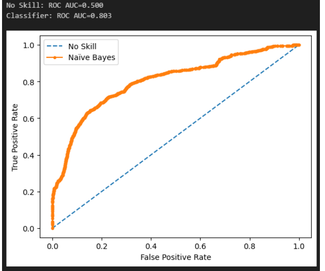

Problem Statement

Evaluating a machine learning model’s performance is essential to determine how well it generalizes to unseen data. After training and testing a Naïve Bayes Classifier, the next step is to assess its discriminative ability—specifically, how effectively the model separates the positive and negative classes.

One of the most widely used metrics for this purpose is the ROC–AUC (Receiver Operating Characteristic – Area Under the Curve) score. The ROC curve illustrates the trade-off between True Positive Rate and False Positive Rate across different threshold settings, while the AUC value summarizes the model’s overall ranking capability.

In this task, you are required to visualize the ROC curve for the trained classifier using a reusable evaluation function.

Objectives

1. Prepare the model for evaluation

Ensure the Naïve Bayes classifier is trained.
Generate predictions for test data.
Import the custom module ML_Modules and evaluate preliminary performance using evaluate_classifier.

2. Implement ROC–AUC functionality

   Define an auc_roc function inside ML_Modules.py that:

Computes the ROC–AUC score
Plots the ROC curve for the given classifier
Accepts parameters: classifier, X_test, and y_test
Prints the ROC–AUC value clearly

3. Visualize the ROC–AUC Curve

Import the updated module.
Call the auc_roc function to generate and display the ROC curve for the trained classifier.
Use the visualization to understand how well the model distinguishes between classes.

This visualization will help determine the model’s ability to correctly classify new observations and guide decisions regarding model improvement or selection.

Sample Visualization

ROC Curve — Line chart:

