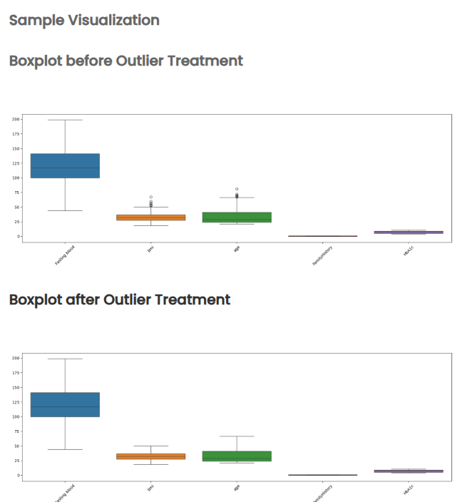

Problem Statement

Outliers can significantly distort statistical summaries and negatively affect machine learning model performance. Before applying any predictive modeling techniques, it is essential to visually inspect and treat extreme values to ensure that the dataset is clean, stable, and reliable.

In this task, you will work with the given diabetes dataset and generate two visualizations using functions defined inside the file ML_Modules.py, and call these functions from main.py.

These visualizations will help compare the dataset before and after outlier treatment.

Files and Functions to Be Used

You must use the following file structure:

1. ML_Modules.py

   This file must contain the following functions:

assess_outliers(data) → Generates boxplots to visualize outliers.
treat_outliers(data) → Applies the IQR winsorization method to cap extreme values.

2. main.py

This file must:

    Load and prepare the dataset.

Call assess_outliers() to display Visualization 1 (Before Treatment).
Call treat_outliers() to apply IQR winsorization.
Call assess_outliers() again to display Visualization 2 (After Treatment).

Objectives

Visualization 1 — Before Outlier Treatment

Boxplots from assess_outliers() that reveal extreme values and irregularities in the raw dataset.

Visualization 2 — After Outlier Treatment

Boxplots generated after applying treat_outliers() that show improved consistency and reduced outlier impact.

