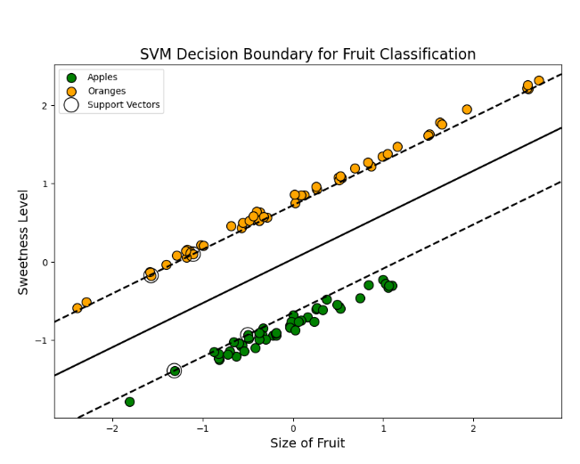

Problem Statement

Support Vector Machines (SVM) are powerful supervised learning algorithms used for classification tasks, especially when the objective is to separate data points into distinct classes using an optimal decision boundary.

In this task, you will visualize how a linear SVM classifier distinguishes between two categories of fruits based on their measurable characteristics. The dataset contains two numeric features representing the physical properties of fruits. Class 0 represents apples, and Class 1 represents oranges.

The goal is to observe how the SVM model creates the separating hyperplane, identifies support vectors, and forms margins around the decision boundary.

Note: Create the dataset from scratch using make_classification, ensuring it contains 100 samples, exactly 2 numeric features (representing fruit size and sweetness), 2 classes (apples and oranges), 1 cluster per class, no redundant features, and a fixed random_state(42) for reproducibility.

You must also structure your solution across two files:

main.py → for dataset creation, model training, and calling the visualization

ML_Modules.py → must contain a single function named: plot_svm_fruit_classification(X, y, model)

You are required to generate a visualization that plots the fruit data points and overlays the decision boundary, margins, and support vectors computed by the trained SVM classifier. This plot helps learners understand how SVM determines the optimal separation between classes.

Objectives

1. Visualize the fruit dataset

Plot all data points using a scatter plot.
Apples (Class 0) must appear as one color, and oranges (Class 1) as a different color.
Ensure the two fruit categories are clearly distinguishable on the plot.

2. Train and apply a linear SVM classifier

Use the student-generated two-feature dataset representing fruit size and sweetness.
Fit a linear SVM classifier to separate the two fruit classes.

3. Display the SVM decision boundary

Plot the hyperplane, which represents the linear decision boundary that separates apples and oranges.
The hyperplane must appear as a solid black line.

4. Display the margins

Plot the two margin lines parallel to the hyperplane.
These lines should appear as black dashed lines.
The margins represent the maximum distance that still correctly separates both classes.

5. Highlight the support vectors

Display the support vectors directly on the graph.
Support vectors should appear as distinct points with no fill color and a clearly visible outline.
These are the critical data points that influence the final position of the hyperplane.

Expected Output Visualization

The final visualization must include:
A scatter plot showing apples and oranges as two different colored clusters
A solid black line representing the SVM decision boundary (hyperplane)
Two dashed black lines representing the margins
Highlighted support vectors indicating the key data points used to define the boundary

Sample Visualization

This plot demonstrates how SVM classification works by separating fruit classes through an optimal hyperplane while maximizing the margin. It provides a clear understanding of the relationship between data distribution, support vectors, and the resulting decision boundary.
