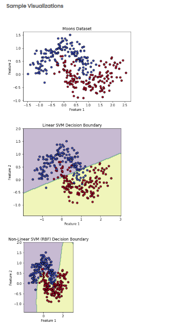

    Problem Statement

    Some real-world datasets contain patterns that cannot be separated using a straight line. The Moons dataset is a classic example of non-linear data, where two curved clusters overlap in crescent shapes. Linear models fail to classify this structure accurately because a straight decision boundary cuts across both classes.

    In this task, you will explore how Support Vector Machines behave on non-linearly separable data. You will generate three visualizations comparing:

    The raw Moons dataset
    A linear SVM decision boundary
    A non-linear SVM (RBF kernel) decision boundary

    This comparison demonstrates why kernel methods are essential for solving complex non-linear classification problems.

    Note:

    Generate the dataset using: make_moons(n_samples=300, noise=0.2, random_state=42)

    This ensures:

    300 samples
    Curved two-class structure
    Some noise
    Reproducibility

    File Structure Requirements

    Your solution must be split across two files:

    ML_Modules.py

        This file must contain exactly two functions:

    (a) plot_moons_dataset(X, y)

    → Creates the basic scatter plot of the raw Moons dataset.

    (b) plot_svm_decision_boundary(model, X, y, title)

    → Plots the decision regions and overlays the data points.

    main.py

        This file must:

    Generate the Moons dataset
    Train a linear SVM and an RBF kernel SVM
    Call the functions from ML_Modules.py to produce all three required visualizations

    Objectives

    1. Visualization 1 — Scatter Plot of the Moons Dataset

    This plot must:
    Display the two interlocking moon-shaped clusters generated by the dataset.
    Color the points based on their class labels.
    Clearly show that the classes follow curved, overlapping shapes that are not linearly separable.

        This visualization establishes the challenging structure of the dataset before applying any SVM models.

    2. Visualization 2 — Linear SVM Decision Boundary

    This plot must:
    Train a linear SVM classifier using the Moons dataset.
    Display the predicted class regions using a filled contour plot.
    Overlay the original data points for comparison.
    Clearly show that the linear SVM forms a straight decision boundary that intersects both moon clusters, resulting in incorrect classification.

        This visualization demonstrates the limitation of linear SVM when applied to curved data distributions.

    3. Visualization 3 — Non-Linear SVM (RBF Kernel) Decision Boundary

    This plot must:
    Train an SVM classifier using the RBF kernel.
    Display the curved decision regions generated by the model.
    Show how the non-linear classifier adapts to the crescent shapes in the dataset.
    Illustrate a smooth, flexible boundary that correctly separates the two moon clusters.

        This visualization highlights the effectiveness of kernel-based SVM models for non-linear classification problems.

    Expected Outcome

        By comparing all three visualizations, learners should clearly understand the following concepts:

    The Moons dataset is inherently non-linear and cannot be separated using a straight line.
    Linear SVM struggles to classify such data accurately due to its rigid decision boundary.
    Non-linear SVM with an RBF kernel produces a curved and adaptive decision boundary that correctly separates the clustered regions.
    Problem Statement

    Some real-world datasets contain patterns that cannot be separated using a straight line. The Moons dataset is a classic example of non-linear data, where two curved clusters overlap in crescent shapes. Linear models fail to classify this structure accurately because a straight decision boundary cuts across both classes.

    In this task, you will explore how Support Vector Machines behave on non-linearly separable data. You will generate three visualizations comparing:

    The raw Moons dataset
    A linear SVM decision boundary
    A non-linear SVM (RBF kernel) decision boundary

    This comparison demonstrates why kernel methods are essential for solving complex non-linear classification problems.

    Note:

    Generate the dataset using: make_moons(n_samples=300, noise=0.2, random_state=42)

    This ensures:

    300 samples
    Curved two-class structure
    Some noise
    Reproducibility

    File Structure Requirements

    Your solution must be split across two files:

    ML_Modules.py

        This file must contain exactly two functions:

    (a) plot_moons_dataset(X, y)

    → Creates the basic scatter plot of the raw Moons dataset.

    (b) plot_svm_decision_boundary(model, X, y, title)

    → Plots the decision regions and overlays the data points.

    main.py

        This file must:

    Generate the Moons dataset
    Train a linear SVM and an RBF kernel SVM
    Call the functions from ML_Modules.py to produce all three required visualizations

    Objectives

    1. Visualization 1 — Scatter Plot of the Moons Dataset

    This plot must:
    Display the two interlocking moon-shaped clusters generated by the dataset.
    Color the points based on their class labels.
    Clearly show that the classes follow curved, overlapping shapes that are not linearly separable.

        This visualization establishes the challenging structure of the dataset before applying any SVM models.

    2. Visualization 2 — Linear SVM Decision Boundary

    This plot must:
    Train a linear SVM classifier using the Moons dataset.
    Display the predicted class regions using a filled contour plot.
    Overlay the original data points for comparison.
    Clearly show that the linear SVM forms a straight decision boundary that intersects both moon clusters, resulting in incorrect classification.

        This visualization demonstrates the limitation of linear SVM when applied to curved data distributions.

    3. Visualization 3 — Non-Linear SVM (RBF Kernel) Decision Boundary

    This plot must:
    Train an SVM classifier using the RBF kernel.
    Display the curved decision regions generated by the model.
    Show how the non-linear classifier adapts to the crescent shapes in the dataset.
    Illustrate a smooth, flexible boundary that correctly separates the two moon clusters.

        This visualization highlights the effectiveness of kernel-based SVM models for non-linear classification problems.

    Expected Outcome

        By comparing all three visualizations, learners should clearly understand the following concepts:

    The Moons dataset is inherently non-linear and cannot be separated using a straight line.
    Linear SVM struggles to classify such data accurately due to its rigid decision boundary.
    Non-linear SVM with an RBF kernel produces a curved and adaptive decision boundary that correctly separates the clustered regions.

    

    These visualizations collectively show why kernel methods are necessary when dealing with complex and non-linear data patterns.
