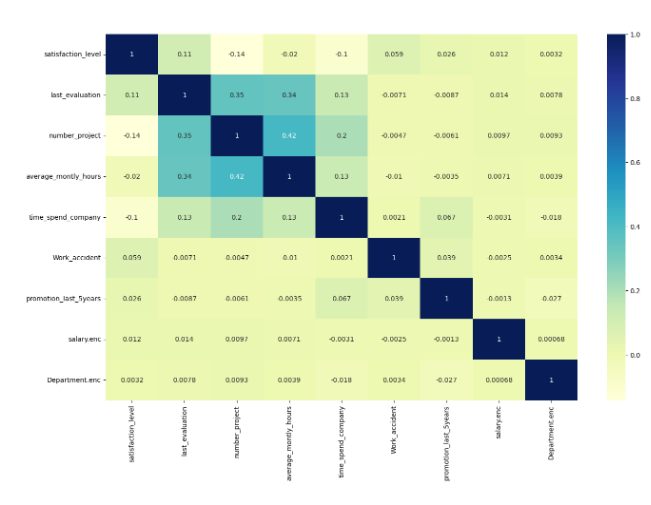

Problem Statement

Before building predictive models, it is important to understand the relationships between different features in the dataset. Features that are highly correlated can lead to multicollinearity, which may reduce model interpretability and affect performance.

In this task, you are required to compute and visualize correlations among all feature variables using a heatmap. This visualization will help identify which features are strongly correlated and guide the selection of the most appropriate features for modeling.

Objectives

1. Encode categorical variables

Convert categorical columns (e.g., salary, Department) into numeric values using label encoding.

2. Compute correlations among features

Select all feature columns (exclude the label column left)
Compute the correlation matrix for numerical features

3. Visualize correlations using a heatmap

Generate a heatmap with annotated correlation values
Use an appropriate color map to distinguish positive and negative correlations
Highlight strongly correlated features to assist in feature selection

Sample Visualization

Heatmap:

This heatmap will visually display the correlation coefficients among all features, helping to detect multicollinearity and inform feature selection for model building.
