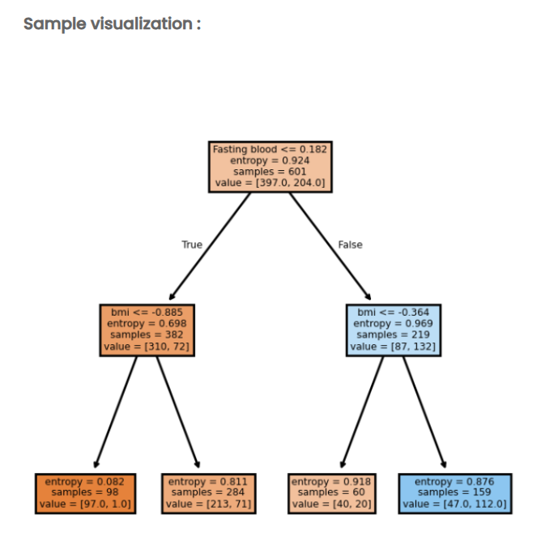

Problem Statement

A healthcare analytics team has successfully built a Decision Tree classifier to predict diabetes risk in patients based on various health metrics. After training the model, the team now needs to visualize the decision-making process of the tree to understand how it classifies patients and to communicate the model's logic to healthcare professionals and stakeholders.

Decision Tree visualization is crucial for model interpretability, allowing medical practitioners to understand the sequential decision rules the model uses. By visualizing the tree structure, the team can identify which features are most important at different stages of classification, understand the split thresholds, and evaluate the purity (entropy) of nodes.

Objectives

The team needs to create a comprehensive Decision Tree visualization that displays:

1. Tree Structure Visualization

Create a hierarchical tree diagram showing the complete decision path from root to leaf nodes
Display decision nodes (internal nodes) and leaf nodes (terminal nodes) with appropriate visual distinction
Show the parent-child relationships and branching structure clearly with connecting edges
Label branches with decision rules (True/False conditions)

2. Node Information Display

For Decision Nodes (Internal Nodes):  
Feature name and split threshold (e.g., "Fasting blood <= 0.182")
Entropy value showing the impurity of the node
Number of samples reaching that node
Class distribution (value = [class_0_count, class_1_count])
For Leaf Nodes (Terminal Nodes):  
Entropy value (should be low, indicating high purity)
Number of samples in the final classification
Class distribution showing predicted outcomes

3. Visual Encoding and Color Scheme

Use color coding to distinguish between different node types or class distributions:  
Root node and decision nodes with specific background colors
Leaf nodes with distinct coloring to indicate final predictions
Consider using color intensity to represent node purity or class dominance
Apply appropriate node shapes (rectangles/boxes) with rounded corners for better aesthetics
Use clear, readable font sizes for all node labels and split conditions

4. Branch Labels and Decision Paths

Clearly label each branch with "True" and "False" to indicate the direction of the split
Show which path is taken when the condition is satisfied vs. not satisfied
Ensure branches are visually distinct and easy to follow from root to leaves

Expected Deliverables

The visualization should produce:

Complete Decision Tree Diagram showing:
Root node at the top with the first splitting feature
Multiple levels of decision nodes showing the hierarchical structure
Terminal leaf nodes at the bottom showing final classification outcomes
All nodes containing complete information (split condition, entropy, samples, value)
Clear Decision Paths demonstrating:
How a patient's data flows through the tree
Which features are evaluated at each step
The thresholds used for making decisions
The final classification outcome
Interpretable Model Representation that allows stakeholders to:
Understand the most important features for prediction
See how many patients fall into each decision path
Evaluate the confidence of predictions based on node purity (entropy)
Identify which paths lead to diabetic vs. non-diabetic predictions

