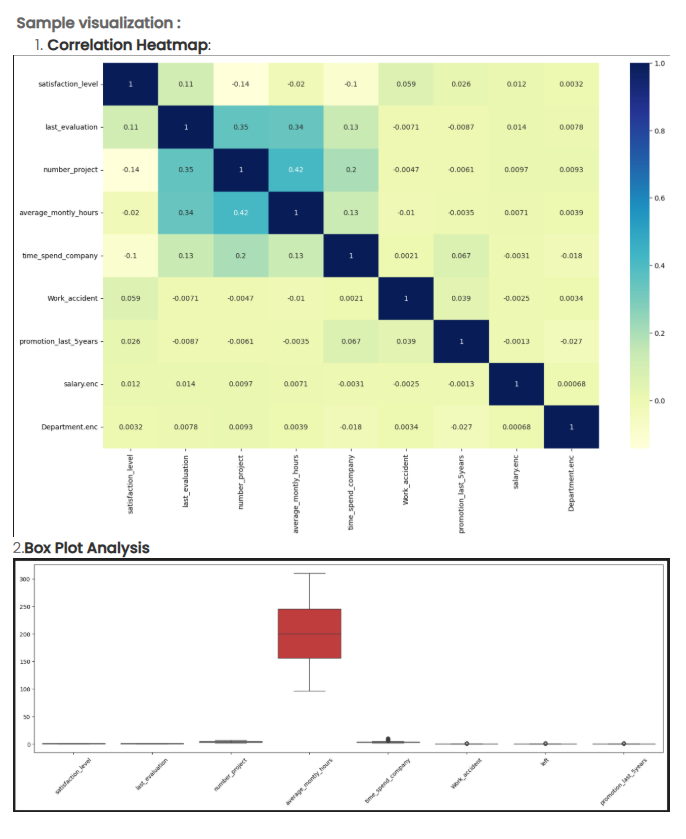

Problem Statement

Employee retention is a critical challenge for any growing organization. High turnover not only increases recruitment and training costs but also results in the loss of valuable skills and expertise. To support strategic HR decision-making, the company aims to conduct a comprehensive exploratory data analysis to identify the factors influencing employee attrition through advanced visualization techniques.

In this task, you are required to perform a multi-dimensional analysis of the employee dataset by creating two key visualizations that reveal patterns and relationships within the data.

Objectives

1. Analyze feature correlations using a correlation heatmap

Create a correlation matrix heatmap that visualizes the relationships between all numeric features in the dataset
Include encoded categorical variables (Department and salary) to understand their correlation with other features
Use a color-coded visualization (with values ranging from -1 to 1) to identify:  
Strong positive correlations (darker blue, closer to 1.0)
Strong negative correlations (if any)
Weak or negligible correlations (lighter colors, closer to 0)
Display correlation coefficients within each cell of the heatmap for precise interpretation
Identify which features have the strongest relationships with employee retention

2. Examine feature distributions using box plots

Create box plot visualizations for all numeric features in the dataset to understand their statistical distributions
Display the following for each feature:  
Median (center line within the box)
Quartiles (Q1 and Q3, forming the box boundaries)
Interquartile range (IQR)
Whiskers showing the range of the data
Outliers (if present, shown as individual points)
Arrange all box plots horizontally in a single figure for easy comparison across features
Features to visualize include: satisfaction_level, last_evaluation, number_project, average_montly_hours, time_spend_company, Work_accident, left, and promotion_last_5years

3. Derive actionable insights

Identify which features show the strongest correlations with employee attrition (the 'left' variable)
Determine if there are any unexpected relationships between features
Assess which features have high variability versus those that are more stable
Detect potential outliers that may require special attention

Expected Deliverables

This analysis will produce two comprehensive visualizations:

Correlation Heatmap: A color-coded matrix showing pairwise correlations between all features, with annotations displaying correlation coefficients
Box Plot Analysis: A multi-panel horizontal box plot displaying the distribution characteristics of all numeric features

This exploratory visual analysis forms the foundation for deeper statistical modeling and will guide the development of targeted employee retention programs.

