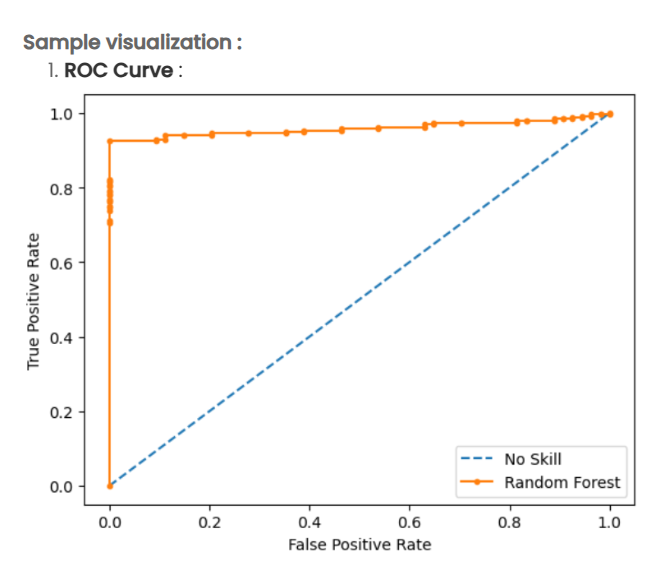

Problem Statement

A healthcare research institution has developed a Random Forest classifier for diabetes prediction using comprehensive patient health data. While cross-validation metrics provide overall accuracy, the team needs to deeply understand the model's discriminative ability and its performance trade-offs across different classification thresholds. This understanding is critical for clinical deployment, where the balance between sensitivity (detecting actual diabetes cases) and specificity (avoiding false alarms) must be carefully optimized based on medical priorities.

The institution needs to visualize the model's Receiver Operating Characteristic (ROC) curve to assess its classification performance across all possible decision thresholds and compare it against a baseline random classifier to quantify the actual predictive value added by the machine learning model.

Objectives

1. Generate ROC Curve for Random Forest Model

Train Random Forest with robust cross-validation – Use Repeated Stratified K-Fold (10 folds, 3 repeats) to train the model
Extract probability predictions – Generate predicted probabilities for the positive class (diabetes) rather than binary classifications
Calculate ROC metrics – Compute True Positive Rate (TPR/Recall/Sensitivity) and False Positive Rate (FPR) at multiple thresholds
Visualize discriminative ability – Plot the ROC curve showing how TPR and FPR change as the classification threshold varies

2. Compare Against Baseline "No Skill" Classifier

Plot diagonal reference line – Display the performance of a random classifier that assigns classes with 50% probability
Quantify improvement – Visually demonstrate how much better the Random Forest performs compared to random guessing
Calculate AUC – Compute Area Under the ROC Curve to quantify overall discrimination ability

3. Visual Analysis and Interpretation

Assess curve shape – Strong models show curves that bow sharply toward the upper-left corner
Identify optimal thresholds – Visualize the threshold points where different TPR/FPR trade-offs can be selected
Clinical decision support – Enable stakeholders to choose operating points based on medical priorities

Expected Deliverables

ROC Curve Visualization

Purpose: Demonstrate the Random Forest model's superior discriminative ability compared to random chance

Visual Elements:

Random Forest ROC Curve (Solid Orange Line with Markers):  
Plots True Positive Rate vs. False Positive Rate
Each point represents a different classification threshold
Curve should bow strongly toward upper-left corner
Circular markers at each threshold point
Solid line connecting all points
Orange/red color to distinguish from baseline
"No Skill" Baseline (Dashed Blue Diagonal):  
Straight diagonal line from (0,0) to (1,1)
Represents random guessing (AUC = 0.5)
Blue dashed line style
Serves as reference for model comparison
Axes and Labels:  
X-axis: "False Positive Rate" (0.0 to 1.0)
Y-axis: "True Positive Rate" (0.0 to 1.0)
Both axes equally scaled
Grid optional for easier reading
Legend:  
"No Skill" - Dashed blue baseline
"Random Forest" - Solid orange model curve
Positioned clearly (upper-left or lower-right)

Key Visual Characteristics:

The Random Forest curve shows dramatic early rise in TPR with minimal FPR increase
Curve rapidly approaches TPR ≈ 0.7-0.9 while FPR is still near 0
Significant separation from the diagonal baseline throughout
Near-perfect performance (approaching upper-left corner) indicates excellent discrimination

Example Interpretation

Based on the provided image showing an excellent ROC curve:

Visual Analysis: "The Random Forest model demonstrates exceptional discriminative ability with a ROC curve that rises steeply and maintains separation from the baseline throughout. The curve reaches approximately 90% True Positive Rate (sensitivity) while keeping False Positive Rate below 5%, indicating the model correctly identifies 9 out of 10 diabetic patients while only misclassifying 1 in 20 non-diabetic patients as false positives."

AUC Estimate: "The Area Under the Curve appears to be approximately 0.95-0.98, significantly exceeding the random baseline of 0.5. This indicates the model has a 95-98% probability of correctly ranking a randomly chosen diabetic patient higher than a randomly chosen non-diabetic patient."

Clinical Recommendation: "This performance level supports clinical deployment. The threshold can be adjusted based on institutional priorities—a conservative threshold around FPR=0.02 achieves 70% sensitivity for low false alarm rates, while a more sensitive threshold around FPR=0.10 captures over 95% of diabetic cases at the cost of more confirmatory testing."

