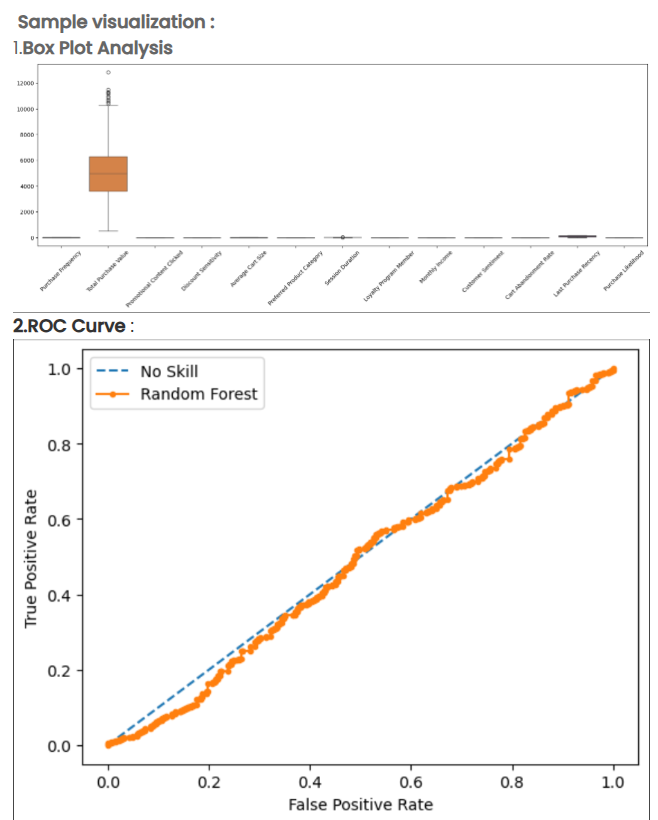

Problem Statement

An e-commerce company has developed a machine learning model to predict customer purchase likelihood and wants to comprehensively evaluate its performance. Beyond simple accuracy metrics, the data science team needs to understand the model's behavior across different features, identify potential data quality issues, and assess the model's discriminative ability using advanced evaluation techniques.

The team has collected customer behavioral data with 17 features including purchase frequency, spending patterns, promotional engagement, product preferences, and demographic information. After training a predictive model, they need to create visualizations that provide deep insights into both the data characteristics and model performance.

Objectives

The team needs to create two critical visualizations for comprehensive model evaluation:

1. Feature Distribution Analysis Using Box Plots

Visualize data distribution across all features – Create a comprehensive box plot showing the statistical distribution of all numeric and encoded categorical features
Identify outliers and data quality issues – Display outliers as individual points beyond the whiskers to understand extreme values in customer behavior
Compare feature scales – Show how different features (purchase amounts, frequencies, rates) vary in range and spread
Detect skewness and variability – Identify which features have high variability versus those that are relatively stable
Feature-specific insights:  
Features like "Total Purchase Value" may show high variability with significant outliers
Binary encoded features (Yes/No) will show minimal variation
Behavioral metrics may show different distribution patterns

2. ROC Curve Analysis for Model Performance

Evaluate classification performance – Generate a Receiver Operating Characteristic (ROC) curve that plots True Positive Rate (TPR) against False Positive Rate (FPR)
Compare against baseline – Include a "No Skill" diagonal reference line representing random guessing (AUC = 0.5)
Calculate Area Under Curve (AUC) – Quantify the model's overall discriminative ability
Assess threshold trade-offs – Understand how different classification thresholds affect the balance between correctly identifying purchasers and minimizing false alarms
Model comparison capabilities – Enable comparison between different models (e.g., Random Forest vs. other algorithms)

Expected Deliverables

Visualization 1: Comprehensive Box Plot Analysis

Purpose: Understand data characteristics and feature behavior across the entire dataset

Visual Elements:

Horizontal layout displaying all features side by side
Box representing the interquartile range (IQR) with:  
Bottom edge at Q1 (25th percentile)
Top edge at Q3 (75th percentile)
Line inside the box showing the median (Q2)
Whiskers extending to show the data range within 1.5×IQR
Individual points plotted beyond whiskers representing outliers
Feature names clearly labeled on the x-axis
Appropriate color coding (e.g., orange/tan boxes with black edges)

Key Insights to Extract:

Which features have the most outliers?
Which features show high variance vs. low variance?
Are there features with skewed distributions?
Do encoded categorical variables show expected patterns (0/1 distributions)?
Are there features that might need additional preprocessing or transformation?

Example Interpretation:

"Total Purchase Value" shows a large box (high IQR) with many outliers above the upper whisker, indicating some customers spend significantly more than typical
Binary features like "Loyalty Program Member" show compressed boxes near 0 and 1
"Purchase Frequency" may show moderate spread with some high-frequency outliers

Visualization 2: ROC Curve with Model Comparison

Purpose: Evaluate the trained model's ability to discriminate between customers likely to purchase versus those unlikely to purchase

Visual Elements:

X-axis: False Positive Rate (FPR) ranging from 0.0 to 1.0
Y-axis: True Positive Rate (TPR) / Recall / Sensitivity ranging from 0.0 to 1.0
Diagonal dashed line labeled "No Skill" representing random chance (AUC = 0.5)
Solid curve labeled with the model name (e.g., "Random Forest") showing actual model performance
Orange/red color for the model curve to distinguish it from the baseline
Blue dashed line for the "No Skill" baseline
Legend clearly identifying both curves

ROC Curve Interpretation Guidelines:

Perfect Model: Curve goes straight up to (0, 1), then across to (1, 1) - AUC = 1.0
Good Model: Curve bows toward the top-left corner - AUC between 0.8-0.95
Moderate Model: Curve shows improvement over diagonal - AUC between 0.7-0.8
Poor Model: Curve close to or below diagonal - AUC ≤ 0.6
Random Guessing: Follows the diagonal - AUC = 0.5

Key Metrics to Report:

AUC (Area Under the ROC Curve) score
Model performance at various thresholds
Comparison against the "No Skill" baseline

Example Interpretation: If the Random Forest curve shows significant separation from the diagonal and bows toward the upper-left quadrant with AUC ≈ 0.85-0.90, this indicates the model has strong discriminative ability and can effectively distinguish between customers likely to purchase and those unlikely to purchase.

