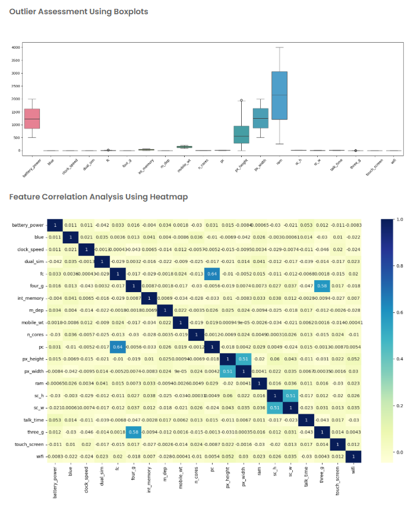

File Upload Question
Problem Statement

In this task, you are required to generate two visualizations to support initial data inspection for a supervised learning problem using a mobile pricing dataset provided at runtime. The visualizations are intended to help understand feature distributions and relationships among input variables before any further preprocessing or modeling.

You will upload the dataset as a CSV file, separate the input features from the target column (price_range), and use predefined functions from ML_Modules.py to produce the required plots.

Only the following two visualizations are expected in this question.

File Structure Requirements

Your solution must use the following files:

ML_Modules.py

    This file must define exactly two visualization functions:

    assess_outliers(data1)

→ Displays boxplots for all input features to visually assess the presence of outliers.

    check_correlation_plot(input_df)

→ Displays a correlation heatmap showing pairwise correlations between input features.

main.py

    This file must:

Read the dataset filename from user input
Load the CSV file
Separate the input features from the target column price_range
Call the required visualization functions from ML_Modules.py

Visualization Tasks

Visualization 1 — Outlier Assessment (Boxplot)

    Using the function assess_outliers():

Generate boxplots for all numerical input features
Visualize the spread and range of each feature
Identify potential extreme values that appear outside the normal distribution
This visualization helps assess whether any features contain unusually high or low values.

Visualization 2 — Feature Correlation Analysis (Heatmap)

    Using the function check_correlation_plot():

Compute the correlation matrix for all input features
Display the correlations using a heatmap with annotated values
Observe the strength and direction of relationships between features
This visualization helps identify strongly correlated features and potential multicollinearity.

Expected Output

The program must display:
One boxplot chart showing outlier distribution across all input features
One correlation heatmap showing pairwise correlations among input features
Both visualizations must be generated using the functions defined in ML_Modules.py and invoked from main.py.

Sample Visualizations

These visualizations provide an initial visual understanding of feature behavior and relationships in the uploaded dataset, supporting informed decisions in subsequent preprocessing or model-building steps.
